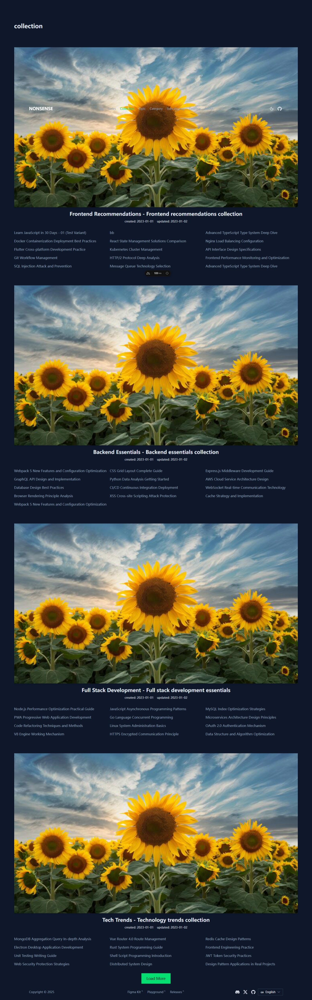
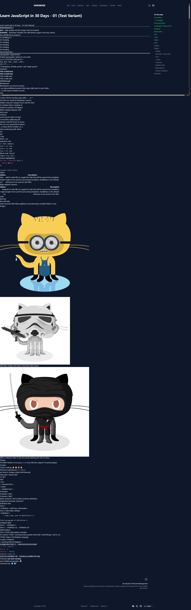

# NUXT4 Blog Base Template

This is a `minimal` blog template based on `Nuxt`, designed to help developers quickly familiarize themselves with the usage and APIs of `Nuxt` and `nuxt/content`, and start DIY-ing their own static sites.

## Modules Used

```
'@nuxt/content',
'@nuxt/ui',
'@nuxtjs/color-mode',
'@nuxt/icon',
'@nuxtjs/i18n'
```

## Features

- Markdown files as content source
- YAML as configuration data source
- Dark/light theme switching
- Component library integration
- Internationalization support
- Support for categorizing articles by `Tag`, `Series`, `Category`, etc.



