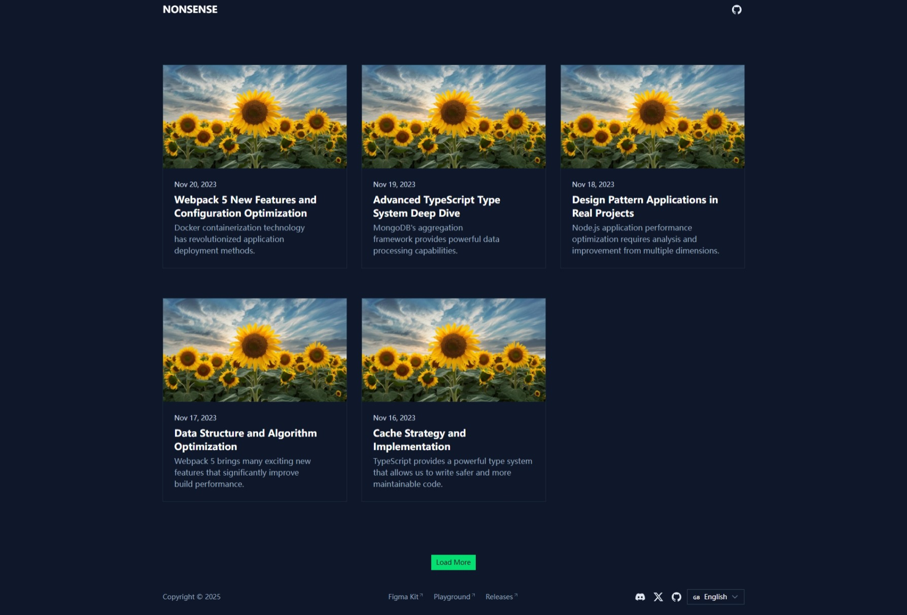
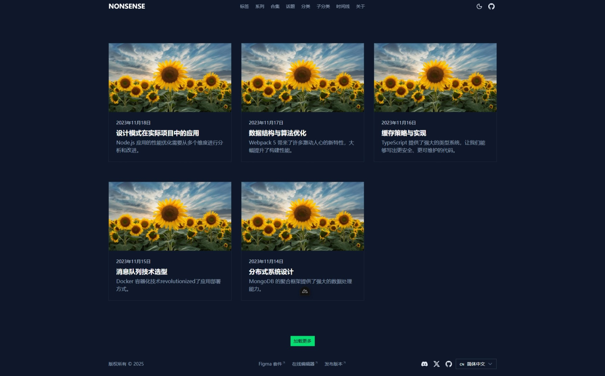
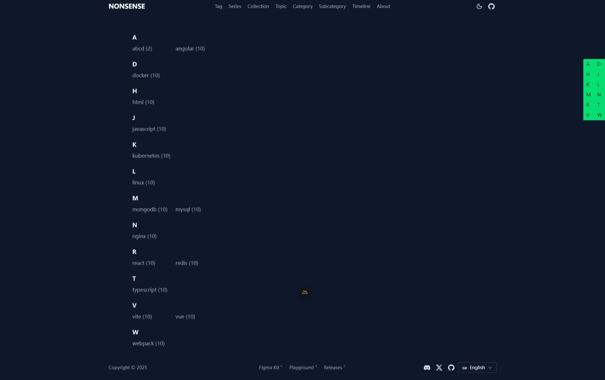
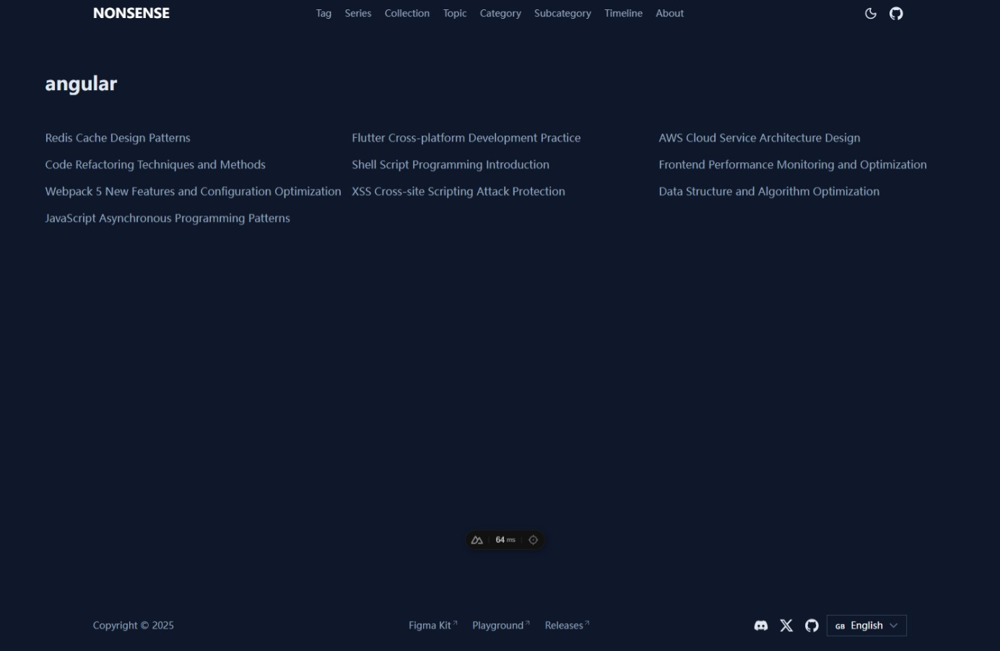
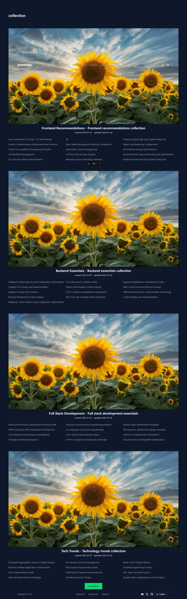
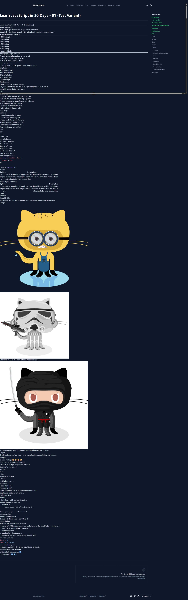

# NUXT4 博客 基础模板

这一个基于`nuxt`的`最精简`博客模板，旨在帮助开发者快速熟悉`nuxt`与`nuxt/content`的用法和API，从而开始DIY自己的静态站点。

## 使用模块

```
'@nuxt/content',
'@nuxt/ui',
'@nuxtjs/color-mode',
'@nuxt/icon',
'@nuxtjs/i18n'
```

## 功能特性

- Markdown文件作为内容源
- Yaml作为配置数据源
- 黑白主题切换
- 组件库集成
- 国际化支持
- 支持以`Tag,Series,Category`等方式对文章进行分类






